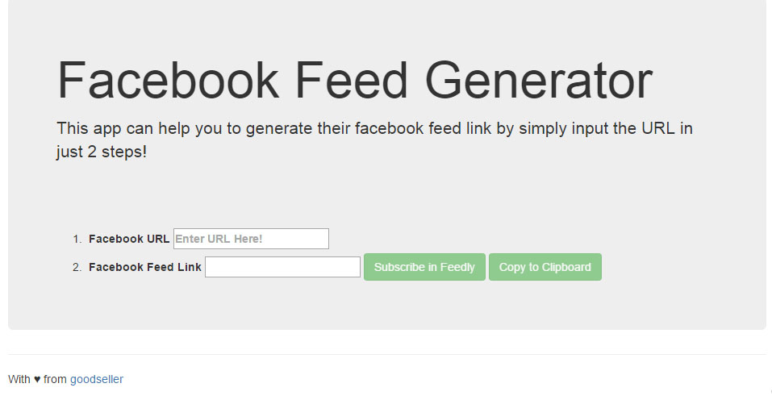
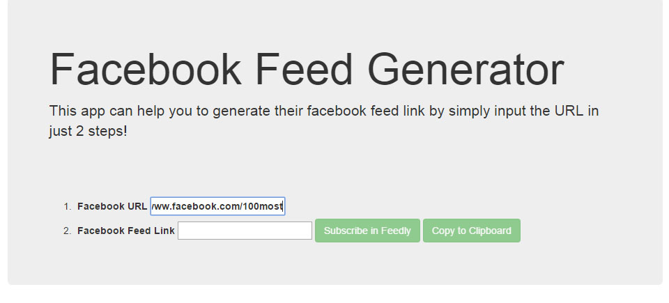
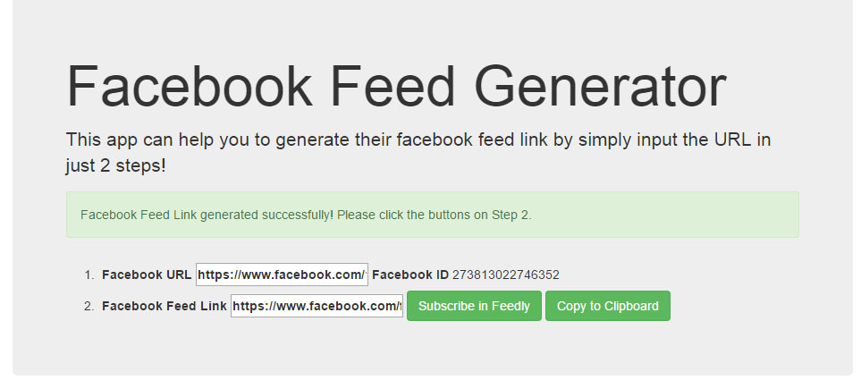
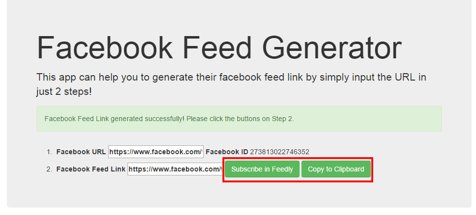
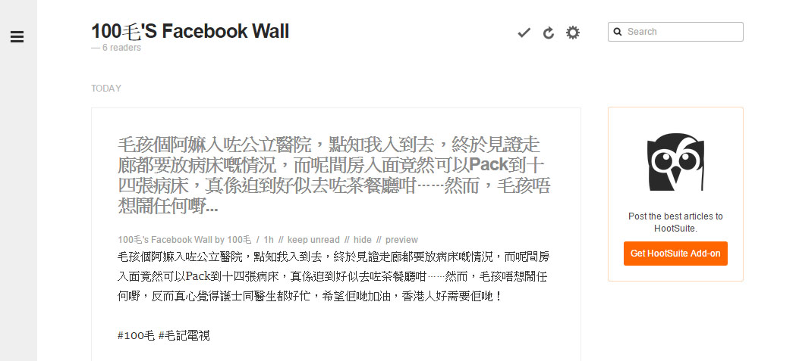

#README

How to use
----------

Feedly link generator allows you to generate the feed link with just 2 steps!

Before start
------------

1.	Access to the [Facebook Feed Generator](fbfeed.github.io) 

2.	Find the page URL for feed generation.

Start Generate
--------------

1.	Enter the URL of the page

	For example: https://www.facebook.com/100most

	

	Wait and system brings you the URL. 

2.	Click the left button to access feedly or Click the right button to copy the feed link to clipboard 

	If you click the left button, it will brings you to [Feedly](https://feedly.com/). Eg. 

**Done!**
